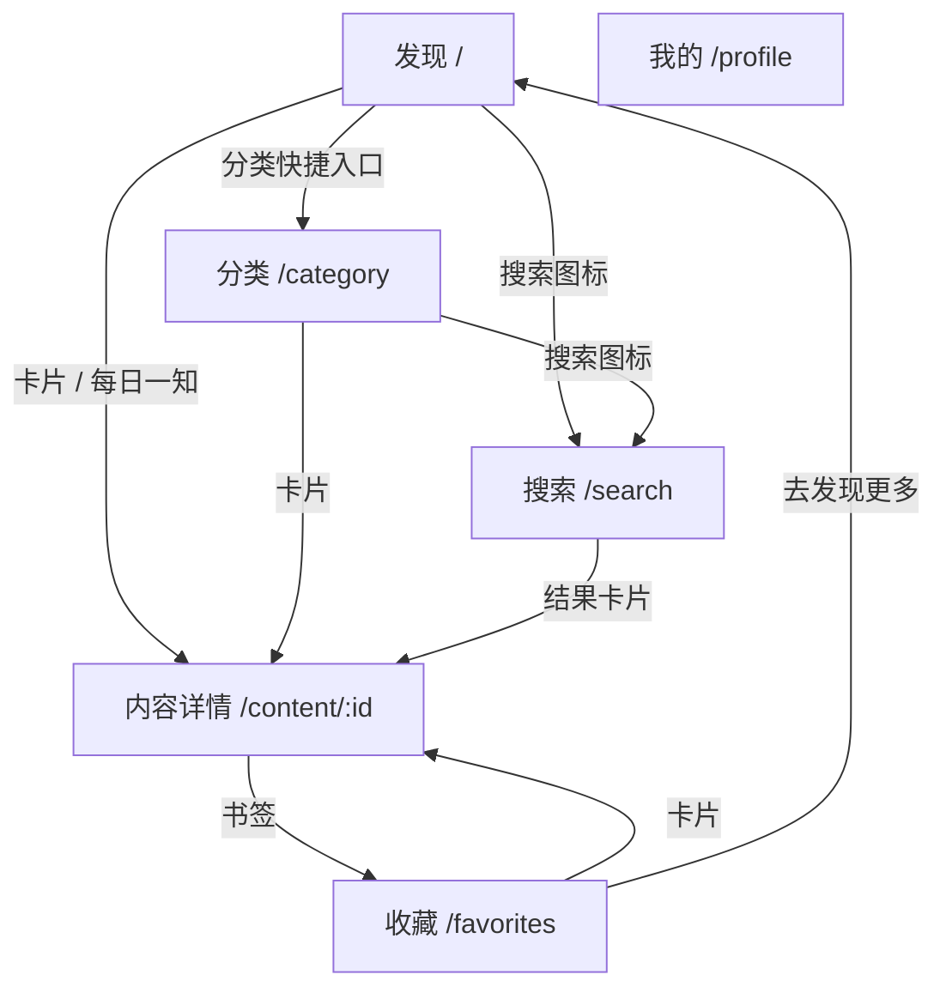

# HealthLive 界面列表

> 本文档列出客户端当前已实现的所有界面、路由与主要交互，便于产品、设计与开发对齐。

路由定义见 `lib/app/router/routes.dart`，页面注册见 `lib/app/router/app_router.dart`。

---

## 导航结构总览

```
MainShell（底部导航栏）
├── 发现（Home）          /
├── 分类（Category）      /category
├── 收藏（Favorites）     /favorites
└── 我的（Profile）       /profile

独立全屏页面（无底部导航）
├── 搜索（Search）        /search
└── 内容详情              /content/:id
```

---

## 界面一览

| # | 界面名称 | 路由 | 源文件 | 底部 Tab | 状态 |
|---|----------|------|--------|----------|------|
| 1 | 发现（首页） | `/` | `lib/features/home/presentation/pages/home_page.dart` | 发现 | 已实现 |
| 2 | 分类浏览 | `/category` | `lib/features/category/presentation/pages/category_page.dart` | 分类 | 已实现 |
| 3 | 我的收藏 | `/favorites` | `lib/features/favorites/presentation/pages/favorites_page.dart` | 收藏 | 已实现 |
| 4 | 我的 | `/profile` | `lib/features/profile/presentation/pages/profile_page.dart` | 我的 | 已实现 |
| 5 | 搜索 | `/search` | `lib/features/search/presentation/pages/search_page.dart` | — | 已实现 |
| 6 | 内容详情 | `/content/:id` | `lib/features/content/presentation/pages/content_detail_page.dart` | — | 已实现 |
| 7 | 登录 | — | — | — | 预留（Profile 入口占位） |

---

## 各界面说明

### 1. 发现（首页）`HomePage`

| 项 | 说明 |
|----|------|
| **AppBar 标题** | HealthLive |
| **入口** | 应用启动默认页；底部 Tab「发现」 |
| **主要区块** | 每日一知卡片、探索分类快捷入口、为你推荐列表 |
| **交互** | 下拉刷新；点击搜索图标进入搜索页；点击卡片进入内容详情；点击分类快捷入口跳转分类 Tab |
| **数据** | `homeDataProvider`（Mock / API） |

---

### 2. 分类浏览 `CategoryPage`

| 项 | 说明 |
|----|------|
| **AppBar 标题** | 分类浏览 |
| **入口** | 底部 Tab「分类」；首页分类快捷入口 |
| **主要区块** | 分段选择器（作息 / 运动 / 饮食）、内容列表 |
| **交互** | 切换分类 Tab；下拉刷新；滚动到底自动加载更多；点击搜索图标进入搜索页；点击卡片进入内容详情 |
| **空状态** | 「该分类暂无内容」 |
| **数据** | `selectedCategoryProvider`、`categoryListProvider` |

**分类枚举**

| 值 | 显示名 | API 字段 |
|----|--------|----------|
| `lifestyle` | 作息 | `lifestyle` |
| `exercise` | 运动 | `exercise` |
| `diet` | 饮食 | `diet` |

---

### 3. 我的收藏 `FavoritesPage`

| 项 | 说明 |
|----|------|
| **AppBar 标题** | 我的收藏 |
| **入口** | 底部 Tab「收藏」 |
| **主要区块** | 已收藏内容列表 |
| **交互** | 下拉刷新；左滑删除收藏；点击卡片进入内容详情 |
| **空状态** | 「还没有收藏内容」+「去发现更多」按钮（跳转首页） |
| **数据** | `favoritesListProvider`（本地 Hive 存储） |

---

### 4. 我的 `ProfilePage`

| 项 | 说明 |
|----|------|
| **AppBar 标题** | 我的 |
| **入口** | 底部 Tab「我的」 |
| **主要区块** | 用户头像区、关于、环境信息、登录（预留） |
| **交互** | 点击「关于 HealthLive」弹出 `AboutDialog` |
| **展示信息** | 当前 Mock / API 模式、`ENV`、`API_BASE_URL` |
| **预留** | 登录入口已占位，待后端 Auth 接口接入后实现 |

---

### 5. 搜索 `SearchPage`

| 项 | 说明 |
|----|------|
| **AppBar** | 内嵌搜索输入框（占位符：搜索作息、运动、饮食相关内容） |
| **入口** | 首页 / 分类页 AppBar 搜索图标 |
| **主要区块** | 搜索历史（关键词为空时）、搜索结果列表 |
| **交互** | 输入即搜；清空关键词；点击历史词快速搜索；清空搜索历史；点击结果进入内容详情 |
| **空状态** | 无历史：「输入关键词开始搜索」；无结果：「没有找到相关内容」 |
| **数据** | `searchKeywordProvider`、`searchHistoryProvider`、`searchResultProvider` |

---

### 6. 内容详情 `ContentDetailPage`

| 项 | 说明 |
|----|------|
| **AppBar 标题** | 内容详情 |
| **路由参数** | `id`：内容 ID，如 `/content/abc123` |
| **入口** | 首页、分类、收藏、搜索等列表卡片点击 |
| **主要区块** | 封面图、标题、分类与日期、标签、核心好处列表、Markdown 详细说明 |
| **交互** | AppBar 书签按钮收藏 / 取消收藏 |
| **数据** | `contentDetailProvider(id)`、`favoriteStatusProvider(id)` |

---

## 公共壳层

### MainShell `main_shell.dart`

底部 `NavigationBar` 四个 Tab，包裹首页、分类、收藏、我的四个主界面：

| Tab 索引 | 标签 | 图标 | 路由 |
|----------|------|------|------|
| 0 | 发现 | explore | `/` |
| 1 | 分类 | category | `/category` |
| 2 | 收藏 | bookmark | `/favorites` |
| 3 | 我的 | person | `/profile` |

搜索页与内容详情使用 `parentNavigatorKey: rootNavigatorKey`，以全屏方式压在当前 Tab 之上，不显示底部导航栏。

---

## 弹窗 / 非路由界面

| 名称 | 触发位置 | 类型 | 说明 |
|------|----------|------|------|
| 关于 HealthLive | 我的 → 关于 HealthLive | `AboutDialog` | 展示应用名、版本 1.0.0、简介 |
| 操作反馈 | 内容详情收藏失败 | `SnackBar` | 显示错误信息 |

---

## 共享 UI 状态（跨页面）

| 组件 | 文件 | 用途 |
|------|------|------|
| `AsyncValueWidget` | `lib/shared/widgets/async_value_widget.dart` | 加载中 / 错误 / 空数据 / 重试 |
| `ContentCard` | `lib/shared/widgets/content_card.dart` | 列表内容卡片 |
| `EmptyState` | `lib/shared/widgets/empty_state.dart` | 空状态占位 |
| `ErrorView` | `lib/shared/widgets/error_view.dart` | 错误页 |
| `LoadingSkeleton` | `lib/shared/widgets/loading_skeleton.dart` | 骨架屏 |
| `TagChip` | `lib/shared/widgets/tag_chip.dart` | 标签胶囊 |

---

## 页面跳转关系



---

## 待实现界面

| 界面 | 模块 | 说明 |
|------|------|------|
| 登录 / 注册 | `features/auth` | 仅存在 `auth_repository` 接口占位，无页面文件 |

---

## 修订记录

| 版本 | 日期 | 说明 |
|------|------|------|
| 1.0.0 | 2026-06-18 | 初版：梳理 6 个已实现页面 + 1 个预留入口 |
